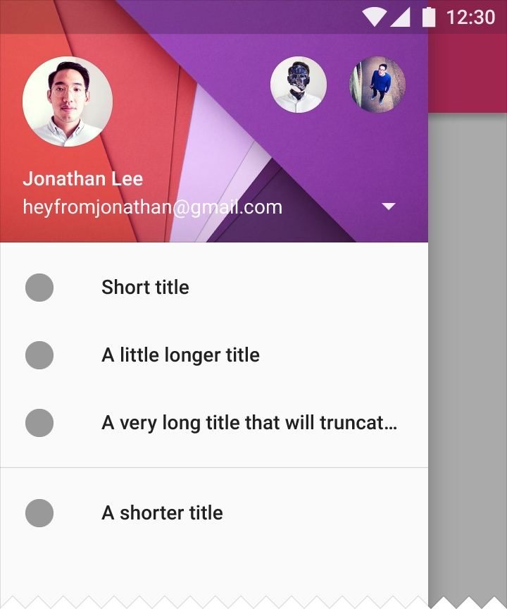

# Creating a Navigation Drawer
## 表现
Navigation Drawer 



手指从屏幕左边右滑，打开的这个像 Menu 一样的的页面就被称为 NavigationDrawer。
谷歌在 MD 规范中详细说明了它的设计规范，在开始设计你的应用时请务必阅读作为参考。
[Navigation Drawer](http://developer.android.com/design/patterns/navigation-drawer.html)

## 实现思路
分析一下，很容易看出来，基本是分为两层。上层的这个 Drawer 层(包含你看到的这个 View 和可能被忽略的覆盖下层的阴影)，下层的包含了页面本身的内容层(ActionBar TabLayout 其它内容)。

## 使用方式
所以，使用也很符合思考模式：以 DrawerLayout 为根 View 包含两层子 View。
### 1. XML 文件
```<android.support.v4.widget.DrawerLayout
    xmlns:android="http://schemas.android.com/apk/res/android"
    android:id="@+id/drawer_layout"
    android:layout_width="match_parent"
    android:layout_height="match_parent">
    <!-- The main content view -->
    <FrameLayout
        android:id="@+id/content_frame"
        android:layout_width="match_parent"
        android:layout_height="match_parent" />
    <!-- The navigation drawer -->
    <ListView android:id="@+id/left_drawer"
        android:layout_width="240dp"
        android:layout_height="match_parent"
        android:layout_gravity="start"
        android:choiceMode="singleChoice"
        android:divider="@android:color/transparent"
        android:dividerHeight="0dp"
        android:background="#111"/>
</android.support.v4.widget.DrawerLayout>
```

**注意的点**
*  内容层必须是DrawerLayout 的第一个子 View。因为 XML 以 View 的顺序决定 Z 的次序。
*  drawer 层必须设定 android:layout_gravity 属性。用来支持 right-to-left 语言。注意用 "start" 代替 "left"。
*  drawer 层的宽度小于320dp，这样展开时也能看到下方的内容。高度 match_parent。

### 2. 代码对内容进行配置
```
public class MainActivity extends Activity {
    private String[] mPlanetTitles;
    private DrawerLayout mDrawerLayout;
    private ListView mDrawerList;
    ...

    @Override
    public void onCreate(Bundle savedInstanceState) {
        super.onCreate(savedInstanceState);
        setContentView(R.layout.activity_main);

        mPlanetTitles = getResources().getStringArray(R.array.planets_array);
        mDrawerLayout = (DrawerLayout) findViewById(R.id.drawer_layout);
        mDrawerList = (ListView) findViewById(R.id.left_drawer);

        // Set the adapter for the list view
        mDrawerList.setAdapter(new ArrayAdapter<String>(this,
                R.layout.drawer_list_item, mPlanetTitles));
        // Set the list's click listener
        mDrawerList.setOnItemClickListener(new DrawerItemClickListener());

        ...
    }
}
```
### 3. 处理其它问题
#### 3.1 处理点击事件导航
给 Drawer 的 ListView 设置 OnItemClickListener 就行。
**示例代码**
```
private class DrawerItemClickListener implements ListView.OnItemClickListener {
    @Override
    public void onItemClick(AdapterView parent, View view, int position, long id) {
        selectItem(position);
    }
}

/** Swaps fragments in the main content view */
private void selectItem(int position) {
    // Create a new fragment and specify the planet to show based on position
    Fragment fragment = new PlanetFragment();
    Bundle args = new Bundle();
    args.putInt(PlanetFragment.ARG_PLANET_NUMBER, position);
    fragment.setArguments(args);

    // Insert the fragment by replacing any existing fragment
    FragmentManager fragmentManager = getFragmentManager();
    fragmentManager.beginTransaction()
                   .replace(R.id.content_frame, fragment)
                   .commit();

    // Highlight the selected item, update the title, and close the drawer
    mDrawerList.setItemChecked(position, true);
    setTitle(mPlanetTitles[position]);
    mDrawerLayout.closeDrawer(mDrawerList);
}

@Override
public void setTitle(CharSequence title) {
    mTitle = title;
    getActionBar().setTitle(mTitle);
}
```
#### 监听 Drawer 展开、关闭事件
调用 DrawerLayout.setDrawerListener() 方法，传递一个 DrawerLayout.DrawerListener 接口的实现。
实现这个接口有两种方式。
1. 直接实现 DrawerListener.
2. 写一个继承 ActionBarDrawerToggle 的子类，这个类实现了这个接口，你可以在子类中重写 DrawerListener 接口函数。

**示例代码**
```
public class MainActivity extends Activity {
    private DrawerLayout mDrawerLayout;
    private ActionBarDrawerToggle mDrawerToggle;
    private CharSequence mDrawerTitle;
    private CharSequence mTitle;
    ...

    @Override
    public void onCreate(Bundle savedInstanceState) {
        super.onCreate(savedInstanceState);
        setContentView(R.layout.activity_main);
        ...

        mTitle = mDrawerTitle = getTitle();
        mDrawerLayout = (DrawerLayout) findViewById(R.id.drawer_layout);
        mDrawerToggle = new ActionBarDrawerToggle(this, mDrawerLayout,
                R.drawable.ic_drawer, R.string.drawer_open, R.string.drawer_close) {

            /** Called when a drawer has settled in a completely closed state. */
            public void onDrawerClosed(View view) {
                super.onDrawerClosed(view);
                getActionBar().setTitle(mTitle);
                invalidateOptionsMenu(); // creates call to onPrepareOptionsMenu()
            }

            /** Called when a drawer has settled in a completely open state. */
            public void onDrawerOpened(View drawerView) {
                super.onDrawerOpened(drawerView);
                getActionBar().setTitle(mDrawerTitle);
                invalidateOptionsMenu(); // creates call to onPrepareOptionsMenu()
            }
        };

        // Set the drawer toggle as the DrawerListener
        mDrawerLayout.setDrawerListener(mDrawerToggle);
    }

    /* Called whenever we call invalidateOptionsMenu() */
    @Override
    public boolean onPrepareOptionsMenu(Menu menu) {
        // If the nav drawer is open, hide action items related to the content view
        boolean drawerOpen = mDrawerLayout.isDrawerOpen(mDrawerList);
        menu.findItem(R.id.action_websearch).setVisible(!drawerOpen);
        return super.onPrepareOptionsMenu(menu);
    }
}
```

#### 通过 App Icon 打开、关闭 Drawer
通过使用 ActionBarDrawerToggle 类，可以控制这些行为。
* 点击控制 Drawer 行为
* 指定展开时的 icon

标准的导航 Icon 图标在 (Download the Action Bar Icon Pack)[http://developer.android.com/downloads/design/Android_Design_Icons_20130926.zip]

最后你需要在 Activity 的生命周期中使用 ActionBarDrawerToggle 的这些方法。
**示例代码**
```
public class MainActivity extends Activity {
    private DrawerLayout mDrawerLayout;
    private ActionBarDrawerToggle mDrawerToggle;
    ...

    public void onCreate(Bundle savedInstanceState) {
        ...

        mDrawerLayout = (DrawerLayout) findViewById(R.id.drawer_layout);
        mDrawerToggle = new ActionBarDrawerToggle(
                this,                  /* host Activity */
                mDrawerLayout,         /* DrawerLayout object */
                R.drawable.ic_drawer,  /* nav drawer icon to replace 'Up' caret */
                R.string.drawer_open,  /* "open drawer" description */
                R.string.drawer_close  /* "close drawer" description */
                ) {

            /** Called when a drawer has settled in a completely closed state. */
            public void onDrawerClosed(View view) {
                super.onDrawerClosed(view);
                getActionBar().setTitle(mTitle);
            }

            /** Called when a drawer has settled in a completely open state. */
            public void onDrawerOpened(View drawerView) {
                super.onDrawerOpened(drawerView);
                getActionBar().setTitle(mDrawerTitle);
            }
        };

        // Set the drawer toggle as the DrawerListener
        mDrawerLayout.setDrawerListener(mDrawerToggle);

        getActionBar().setDisplayHomeAsUpEnabled(true);
        getActionBar().setHomeButtonEnabled(true);
    }

    @Override
    protected void onPostCreate(Bundle savedInstanceState) {
        super.onPostCreate(savedInstanceState);
        // Sync the toggle state after onRestoreInstanceState has occurred.
        mDrawerToggle.syncState();
    }

    @Override
    public void onConfigurationChanged(Configuration newConfig) {
        super.onConfigurationChanged(newConfig);
        mDrawerToggle.onConfigurationChanged(newConfig);
    }

    @Override
    public boolean onOptionsItemSelected(MenuItem item) {
        // Pass the event to ActionBarDrawerToggle, if it returns
        // true, then it has handled the app icon touch event
        if (mDrawerToggle.onOptionsItemSelected(item)) {
          return true;
        }
        // Handle your other action bar items...

        return super.onOptionsItemSelected(item);
    }
    ...
}
```


